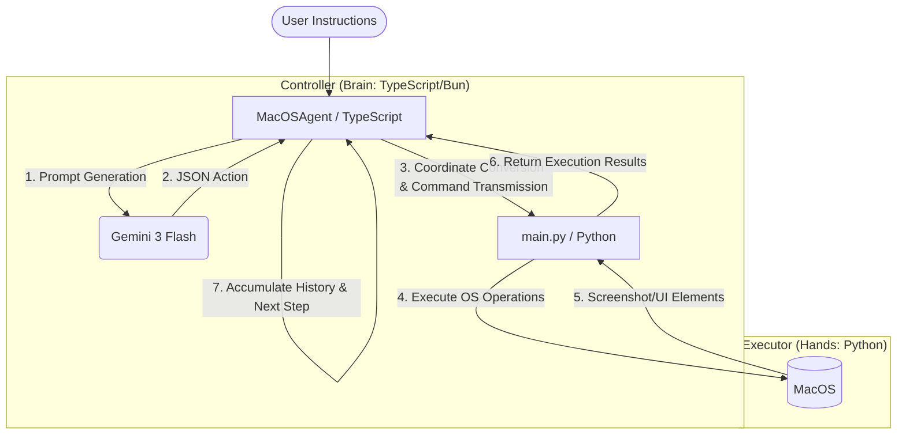

# Miki AI Agent Architecture

[日本語](./ARCHITECTURE_JP.md) | English

This project adopts a hybrid agent architecture that separates **"thinking (LLM)"** and **"execution (OS operations)"**. Use this as a reference when implementing similar systems in other languages or environments.

---

## 1. Overall Structure

---

## 2. Role of Main Components

### A. Controller (TypeScript/Bun)
- **Role**: Dialogue with LLM, managing execution history, parsing actions, normalizing coordinates.
- **Why TypeScript?**:
    - Type-safe use of LLM SDK (Google Generative AI).
    - Efficient coordination with Python processes and LLM through asynchronous processing (Promise/Async-Await).
    - Strict JSON schema validation with Zod.

### B. Executor (Python)
- **Role**: Low-level operations specific to MacOS, image processing.
- **Why Python?**:
    - Cross-platform GUI operations with `pyautogui`.
    - Highlight drawing on images with `Pillow (PIL)`.
    - Easy access to MacOS API via `PyObjC` etc.

---

## 3. Core Implementation Mechanisms

### 1. Inter-Process Communication (IPC)
The Controller spawns a Python process and exchanges JSON messages through **standard input/output (stdin/stdout)**.
- **Controller -> Executor**: `{"action": "click", "params": {"x": 500, "y": 500}}`
- **Executor -> Controller**: `{"status": "success", "execution_time_ms": 120}`

### 2. Coordinate System Normalization (Logical Coordinates)
The LLM thinks in **normalized coordinates from 0 to 1000** independent of resolution.
- **Benefits**: Can use the same prompt on different display resolutions.
- **Flow**:
    1. LLM responds to click at `(500, 500)`.
    2. Controller converts to `(720, 450)` based on current resolution (e.g., 1440x900).
    3. Executor clicks at physical coordinates.

### 3. Highlight Feature (Visual Feedback)
To deepen the "confidence" of operations, the Executor generates **a screenshot with the operation point drawn as a red dot** immediately after action execution and feeds it back to the LLM. This allows the LLM to visually confirm whether it clicked the intended location correctly.

### 4. Direct Retrieval of GUI Elements (Native UI Inspection)
To compensate for the weaknesses of image recognition, `AppleScript` is used to directly retrieve GUI elements (button names, roles, coordinates) from the OS.
- **`elements` action**: Retrieves all elements within a specific app as text data, accurately informing the LLM "where what is."

---

## 4. Tips for Implementation in Other Languages

### Language Selection Points
- **Controller**: Languages that facilitate LLM API calls and JSON processing (TypeScript, Python, Go, Rust).
- **Executor**: Languages with rich OS operation libraries (Python, Swift, C#).

### Alternative Communication Protocols
- **HTTP/gRPC**: Keep the process resident and communicate as an API server.
- **Shared Memory**: Effective for quickly exchanging large screenshot images.

### Points to Note During Implementation
1. **Security**: Strictly limit the types of actions to prevent arbitrary code execution.
2. **Safety Mechanism (Failsafe)**: A mechanism to disable mouse operations in emergencies, like PyAutoGUI's `FAILSAFE = True`, is essential.
3. **Retina Display**: On MacOS etc., physical pixels and logical pixels (Scale Factor) differ, so consideration is needed during coordinate conversion.

---

## 5. Action Schema (Reference)

Main actions implemented:
- `click`: Click specified coordinates.
- `type`: Text input (stabilized using paste).
- `batch`: Execute multiple operations (click->input->Enter, etc.) at once to reduce LLM thinking count.
- `osa`: Direct app operations via AppleScript.
- `elements`: Retrieve UI tree structure.
