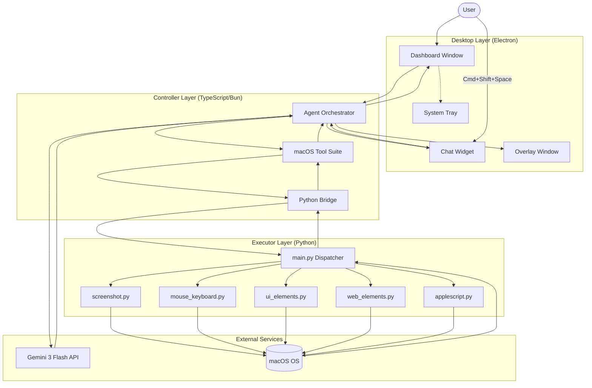
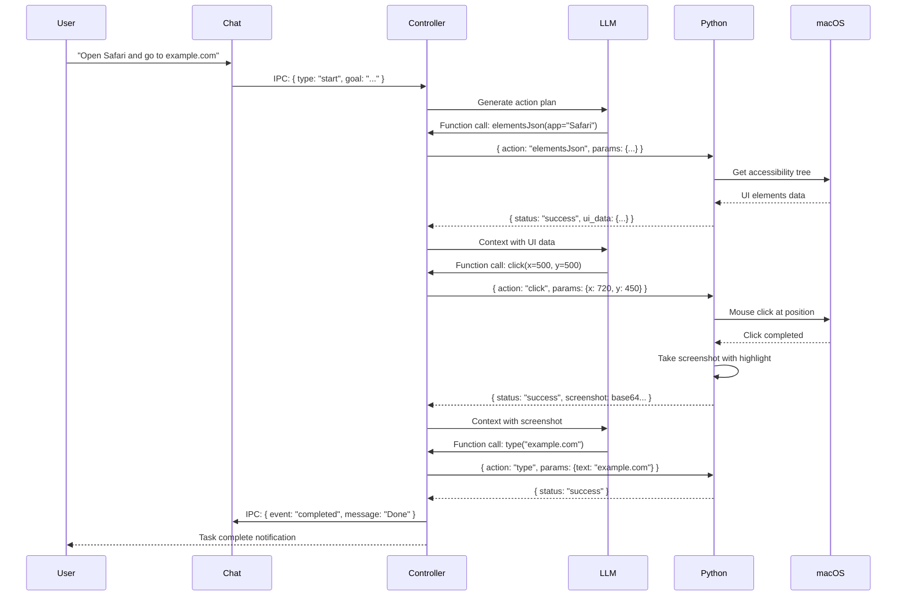
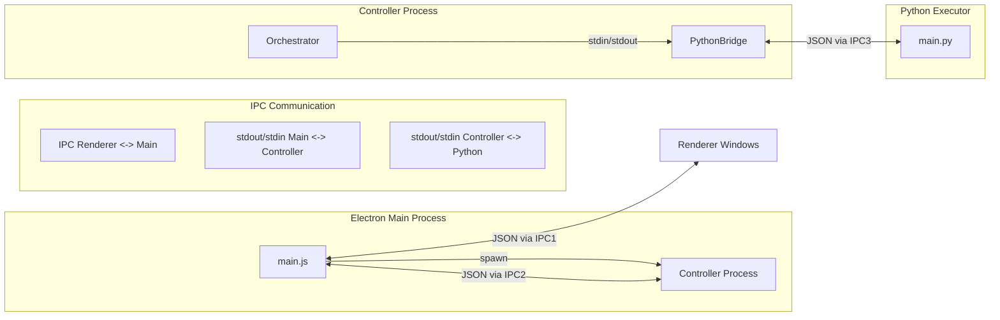
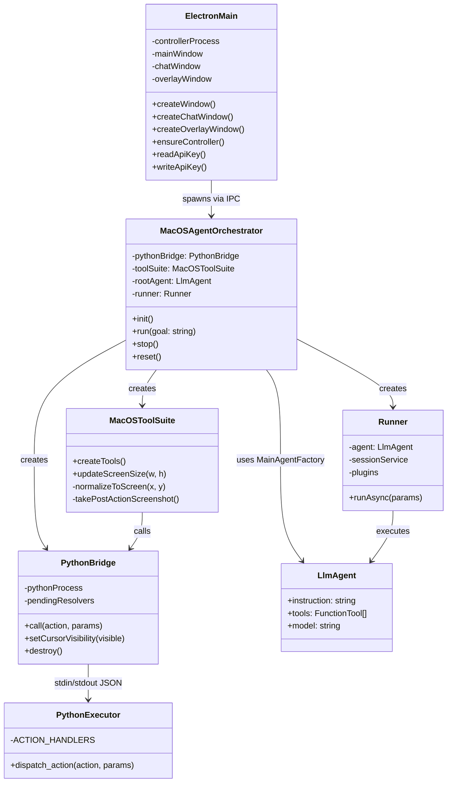

# Miki AI Agent Architecture

[日本語](./ARCHITECTURE_JP.md) | English

This project adopts a hybrid agent architecture that separates **"thinking (LLM)"** and **"execution (OS operations)"**. Use this as a reference when implementing similar systems in other languages or environments.

---

## Table of Contents

1. [Overall Structure](#1-overall-structure)
2. [System Architecture Diagrams](#2-system-architecture-diagrams)
3. [Role of Main Components](#3-role-of-main-components)
4. [Core Implementation Mechanisms](#4-core-implementation-mechanisms)
5. [Security Features](#5-security-features)
6. [Performance Configuration](#6-performance-configuration)
7. [Action Schema Reference](#7-action-schema-reference)
8. [Implementation Tips for Other Languages](#8-implementation-tips-for-other-languages)

---

## 1. Overall Structure

Miki Desktop is a three-layer architecture consisting of **Electron Desktop**, **TypeScript Controller**, and **Python Executor**.



---

## 2. System Architecture Diagrams

### 2.1 Data Flow: User Request Execution



### 2.2 Process Communication Architecture



### 2.3 Component Relationship Diagram



---

## 3. Role of Main Components

### A. Electron Main Process (`desktop/main.js`)

**Role**: Desktop application framework, window management, process spawning

**Key Features**:
- Multi-window management (Dashboard, Chat Widget, Overlay)
- System tray integration with context menu
- Global shortcut registration (`Cmd+Shift+Space`)
- API key encryption using Electron's `safeStorage`
- Permission checking (Accessibility, Screen Recording)
- Content Security Policy (CSP) with dynamic nonce generation
- Controller process spawning and IPC communication

**Why Electron?**
- Cross-platform desktop app framework
- Native macOS integration (tray, shortcuts, permissions)
- Secure key storage capabilities
- Web-based UI development with React

### B. Controller Layer (TypeScript/Bun)

#### B.1 Agent Orchestrator (`src/adk/orchestrator.ts`)

**Role**: Central coordinator for LLM agent execution

**Responsibilities**:
- Initialize tool suite with screen size
- Create and configure LLM agent with Gemini 3 Flash
- Manage session state and user context
- Emit events for UI updates (log, status, action, completion)
- Handle stop/reset requests
- Support debug mode with logging plugin

**Key Methods**:
- `init()`: Initialize screen size, browser detection, tool suite, agent
- `run(goal)`: Execute task with event streaming
- `stop()`: Request graceful stop
- `reset()`: Reset agent state

#### B.2 Python Bridge (`src/core/python-bridge.ts`)

**Role**: Communication layer between TypeScript and Python

**Responsibilities**:
- Spawn Python process via stdin/stdout
- JSON-based command/response protocol
- Automatic crash recovery and restart
- Timeout and retry logic (30s default timeout, 3 retries)
- Queue-based request handling

**Why TypeScript?**
- Type-safe LLM SDK usage (Google Generative AI)
- Efficient async/await for Python and LLM coordination
- Strict JSON schema validation with Zod
- Modern JavaScript runtime with Bun

#### B.3 macOS Tool Suite (`src/adk/tools/macos-tool-suite.ts`)

**Role**: Provide LLM-callable tools for macOS automation

**Available Tools**:
| Tool | Description | Parameters |
|------|-------------|------------|
| `click` | Click at normalized coordinates | x, y (0-1000) |
| `move` | Move mouse cursor | x, y (0-1000) |
| `drag` | Drag and drop | from_x, from_y, to_x, to_y |
| `scroll` | Scroll vertically | amount (positive = down) |
| `type` | Type text input | text |
| `press` | Press single key | key |
| `hotkey` | Press key combination | keys[] |
| `elementsJson` | Get accessibility tree | app_name |
| `focusElement` | Focus UI element | element_id |
| `webElements` | Get browser DOM elements | app_name |
| `osa` | Execute AppleScript | script |
| `wait` | Wait specified seconds | seconds |
| `think` | Record thinking process | thought, phase |
| `done` | Report task completion | message |

### C. Executor Layer (Python)

#### C.1 Main Dispatcher (`src/executor/main.py`)

**Role**: Command dispatcher for OS operations

**Responsibilities**:
- Read JSON commands from stdin
- Dispatch to action handlers (15 actions)
- Return results as JSON
- Track execution time

**Action Handlers** (929 total lines across modules):
- `screenshot.py` - Capture screen with highlight
- `mouse_keyboard.py` - Click, type, press, hotkey, move, scroll, drag
- `applescript.py` - Execute AppleScript
- `ui_elements.py` - Get/focus UI elements via Accessibility API
- `web_elements.py` - Get browser DOM elements

**Why Python?**
- Cross-platform GUI operations with `pyautogui`
- Image processing with `Pillow (PIL)`
- Easy macOS API access via `PyObjC`
- Mature ecosystem for automation

---

## 4. Core Implementation Mechanisms

### 4.1 Inter-Process Communication (IPC)

**Three-tier IPC architecture**:

1. **Renderer <-> Main (Electron IPC)**
   - Secure communication via `contextBridge` and `preload.js`
   - Messages: `miki:start`, `miki:stop`, `miki:getApiKey`, etc.

2. **Main <-> Controller (stdout/stdin)**
   - JSON-based protocol via `readline` interface
   - Controller spawned as separate Node.js process

3. **Controller <-> Python (stdout/stdin)**
   - JSON command/response via `PythonBridge`
   - Request format: `{"action": "click", "params": {"x": 720, "y": 450}}`
   - Response format: `{"status": "success", "execution_time_ms": 120, "data": "..."}`

### 4.2 Coordinate System Normalization

**Logical Coordinates (0-1000 scale)**

The LLM thinks in resolution-independent coordinates:

```typescript
// Normalized (0-1000) -> Physical pixels
private normalizeToScreen(x: number, y: number): { x: number; y: number } {
  return {
    x: Math.round((x / 1000) * this.screenSize.width),
    y: Math.round((y / 1000) * this.screenSize.height),
  };
}
```

**Benefits**:
- Same prompt works on different display resolutions
- Simplifies LLM reasoning about screen positions
- Easy to adapt to retina displays

**Example Flow**:
1. LLM outputs: `click(x=500, y=500)` (center of screen)
2. Controller converts: `{x: 720, y: 450}` (for 1440x900 display)
3. Executor clicks at physical coordinates

### 4.3 Visual Feedback with Screenshots

**Highlight Feature**:

After each action, the executor captures a screenshot with the action point highlighted as a red dot:

```python
# Python: screenshot.py
def screenshot(highlight_pos=None, quality=85):
    img = pyautogui.screenshot()
    if highlight_pos:
        draw = ImageDraw.Draw(img)
        draw.ellipse([...], fill="red")
    # Convert to base64 JPEG
```

**Benefits**:
- LLM can visually confirm operation success
- Reduces error accumulation
- Provides transparency to users

### 4.4 Native UI Inspection

**Accessibility Tree via AppleScript**:

To compensate for vision-only limitations, native UI elements are retrieved:

```applescript
tell application "System Events"
    tell process "Safari"
        set elements to entire contents of front window
    end tell
end tell
```

**Data Structure**:
```json
{
  "role": "AXButton",
  "title": "Go",
  "position": {"x": 720, "y": 450},
  "size": {"width": 50, "height": 30},
  "children": [...]
}
```

### 4.5 Browser Automation

**DOM Element Detection**:

For web automation, DOM elements are extracted via AppleScript:

```applescript
tell application "Safari"
    do JavaScript "document.querySelectorAll('*').length" in front document
end tell
```

**Supported Browsers**:
- Safari (default)
- Google Chrome
- Microsoft Edge
- Arc
- Brave
- Opera
- Vivaldi
- Any Chromium-based browser

---

## 5. Security Features

### 5.1 API Key Encryption

**Electron `safeStorage` Integration**:

```javascript
// Encryption
const encrypted = safeStorage.encryptString(apiKey);
fs.writeFileSync(securePath, encrypted);

// Decryption
const encryptedData = fs.readFileSync(securePath);
const decrypted = safeStorage.decryptString(encryptedData);
```

**Migration from Plain Text**:
- Old `.env` files are automatically migrated to encrypted storage
- Verification step prevents data loss during migration

### 5.2 Content Security Policy (CSP)

**Dynamic Nonce Generation**:

```javascript
function generateNonce() {
  return crypto.randomBytes(16).toString("base64");
}

csp = `default-src 'self'; script-src 'self'; style-src 'self' 'nonce-${nonce}'`;
```

**Per-Window Nonces**:
- Each window gets its own nonce
- Prevents style injection attacks
- Allows Emotion (CSS-in-JS) to work safely

### 5.3 Content Protection

**Screen Capture Prevention**:

```javascript
win.setContentProtection(true);
```

**Limitations**:
- Not effective on macOS 15+ with ScreenCaptureKit
- Some screen recording tools can still capture
- Does not prevent internal screen readers

### 5.4 Context Isolation

**Electron Security Best Practices**:

```javascript
webPreferences: {
  preload: path.join(__dirname, "preload.js"),
  contextIsolation: true,
  nodeIntegration: false
}
```

**Secure IPC Bridge**:
```javascript
// preload.js
contextBridge.exposeInMainWorld('miki', {
  start: (goal) => ipcRenderer.invoke('miki:start', goal),
  getApiKey: () => ipcRenderer.invoke('miki:getApiKey'),
});
```

### 5.5 Action Whitelisting

**Restricted Action Set**:

Only 15 predefined actions are allowed:
- No arbitrary code execution
- No file system write (except safeStorage)
- No network requests (except LLM API)
- Input sanitization via Zod schemas

### 5.6 Failsafe Mechanism

**PyAutoGUI Emergency Abort**:

```python
pyautogui.FAILSAFE = True
```

Move mouse to corner (0, 0) to emergency-stop all operations.

---

## 6. Performance Configuration

Located in `src/core/constants.ts`:

```typescript
export const PERFORMANCE_CONFIG = {
  // Maximum agent execution steps
  MAX_STEPS: 30,

  // Delay between steps (milliseconds)
  STEP_DELAY_MS: 500,

  // Delay between batched actions
  BATCH_ACTION_DELAY_MS: 200,

  // JPEG quality for screenshots (1-100)
  SCREENSHOT_QUALITY: 85,
};
```

**Tuning Guidelines**:
| Setting | Increase For... | Decrease For... |
|---------|----------------|-----------------|
| MAX_STEPS | Complex multi-stage tasks | Simple quick tasks |
| STEP_DELAY_MS | Slower systems/visual clarity | Faster execution |
| SCREENSHOT_QUALITY | Better AI recognition | Lower bandwidth |

**History Size Controls**:

```typescript
export const HISTORY_CONFIG = {
  MAX_MESSAGES: 24,
  MAX_TEXT_CHARS: 1000,
  MAX_DATA_CHARS: 2000,
  MAX_UI_NODES: 200,
  MAX_WEB_ELEMENTS: 200,
  MAX_ACTIONS: 8,
};
```

Prevents token explosion from accumulating too much context.

---

## 7. Action Schema Reference

### 7.1 Mouse Actions

#### Click
```json
{
  "action": "click",
  "params": {
    "x": 500,
    "y": 500
  }
}
```

#### Move
```json
{
  "action": "move",
  "params": {
    "x": 500,
    "y": 500
  }
}
```

#### Drag
```json
{
  "action": "drag",
  "params": {
    "from_x": 300,
    "from_y": 300,
    "to_x": 700,
    "to_y": 700
  }
}
```

### 7.2 Keyboard Actions

#### Type
```json
{
  "action": "type",
  "params": {
    "text": "example.com"
  }
}
```

#### Press
```json
{
  "action": "press",
  "params": {
    "key": "enter"
  }
}
```

#### Hotkey
```json
{
  "action": "hotkey",
  "params": {
    "keys": ["cmd", "space"]
  }
}
```

### 7.3 UI Actions

#### Elements JSON
```json
{
  "action": "elementsJson",
  "params": {
    "app_name": "Safari"
  }
}
```

#### Focus Element
```json
{
  "action": "focusElement",
  "params": {
    "element_id": "AXElement-123"
  }
}
```

### 7.4 Screenshot Action

```json
{
  "action": "screenshot",
  "params": {
    "highlight_pos": {
      "x": 720,
      "y": 450
    },
    "quality": 85
  }
}
```

---

## 8. Implementation Tips for Other Languages

### 8.1 Language Selection Points

| Layer | Recommended Languages | Rationale |
|-------|----------------------|-----------|
| **Controller** | TypeScript, Python, Go, Rust | LLM API support, JSON handling, async |
| **Executor** | Python, Swift, C#, JavaScript | OS automation libraries |

### 8.2 Alternative Communication Protocols

| Protocol | Pros | Cons |
|----------|------|------|
| **stdin/stdout** | Simple, no dependencies | One-way communication only |
| **HTTP/gRPC** | Full-duplex, scalable | More complex setup |
| **Shared Memory** | Fast for large data | Platform-specific |
| **Named Pipes** | Bidirectional, simple | Platform-specific |

### 8.3 Key Implementation Considerations

1. **Security**: Whitelist actions only, no arbitrary code execution
2. **Failsafe**: Emergency stop mechanism always required
3. **Retina Displays**: Account for scale factor in coordinate conversion
4. **Error Recovery**: Automatic process restart on crash
5. **Timeout Protection**: Prevent hanging operations
6. **Context Limits**: Control LLM history size to manage token usage

### 8.4 Portability Checklist

- [ ] Coordinate normalization system
- [ ] Inter-process communication protocol
- [ ] Action whitelist with schemas
- [ ] Visual feedback (screenshots with highlights)
- [ ] Native UI inspection capability
- [ ] Error handling and retry logic
- [ ] Security (encrypted storage, CSP, input validation)
- [ ] Performance tuning constants

---

## File Reference

| Component | File Path | Lines |
|-----------|-----------|-------|
| Electron Main | `desktop/main.js` | 727 |
| Orchestrator | `src/adk/orchestrator.ts` | 253 |
| Python Bridge | `src/core/python-bridge.ts` | 200 |
| Tool Suite | `src/adk/tools/macos-tool-suite.ts` | 250 |
| Python Executor | `src/executor/main.py` | 92 |
| Action Modules | `src/executor/actions/*.py` | 929 |

---

*Last Updated: 2026-01-13*
