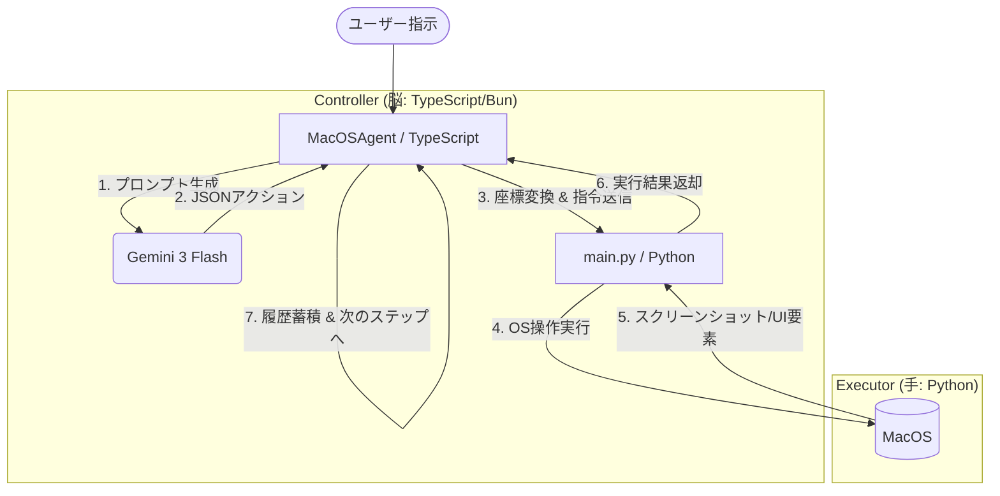

# Miki AI Agent アーキテクチャ解説

日本語 | [English](./ARCHITECTURE.md)

このプロジェクトは、**「思考（LLM）」**と**「実行（OS操作）」**を分離した、ハイブリッドなエージェントアーキテクチャを採用しています。他の言語や環境で同様のシステムを実装する際の参考にしてください。

---

## 1. 全体構造図

---

## 2. 主要コンポーネントの役割

### A. Controller (TypeScript/Bun)
- **役割**: LLM との対話、実行履歴の管理、アクションのパース、座標の正規化。
- **なぜ TypeScript か**:
    - LLM SDK (Google Generative AI) の型安全な利用。
    - 非同期処理（Promise/Async-Await）による Python プロセスや LLM との効率的な連携。
    - Zod による厳密な JSON スキーマ検証。

### B. Executor (Python)
- **役割**: MacOS 固有の低レイヤー操作、画像処理。
- **なぜ Python か**:
    - `pyautogui` によるクロスプラットフォームな GUI 操作。
    - `Pillow (PIL)` による画像へのハイライト描画。
    - `PyObjC` 等を介した MacOS API へのアクセスが容易。

---

## 3. 実装の核心的な仕組み

### 1. プロセス間通信 (IPC)
Controller は Python プロセスを `spawn` し、**標準入出力 (stdin/stdout)** を通じて JSON メッセージをやり取りします。
- **Controller -> Executor**: `{"action": "click", "params": {"x": 500, "y": 500}}`
- **Executor -> Controller**: `{"status": "success", "execution_time_ms": 120}`

### 2. 座標系の正規化 (Logical Coordinates)
LLM は解像度に依存しない **0から1000の正規化座標** で思考します。
- **メリット**: 異なるディスプレイ解像度でも同じプロンプトを使用可能。
- **フロー**:
    1. LLM が `(500, 500)` をクリックと回答。
    2. Controller が現在の解像度（例: 1440x900）に基づき `(720, 450)` へ変換。
    3. Executor が物理座標でクリック。

### 3. ハイライト機能 (Visual Feedback)
操作の「確信」を深めるため、Executor はアクション実行直後に **操作地点を赤い点で描画したスクリーンショット** を生成し、LLM にフィードバックします。これにより、LLM は自分が意図した場所を正しくクリックできたかを視覚的に確認できます。

### 4. GUI 要素の直接取得 (Native UI Inspection)
画像認識の弱点を補うため、`AppleScript` を使用して OS から直接 GUI 要素（ボタン名、役割、座標）を取得します。
- **`elements` アクション**: 特定のアプリ内の全要素をテキストデータとして取得し、LLM に「どこに何があるか」を正確に伝えます。

---

## 4. 他の言語で実装する場合のヒント

### 言語選定のポイント
- **Controller**: LLM API の呼び出しと JSON 処理が容易な言語（TypeScript, Python, Go, Rust）。
- **Executor**: OS 操作ライブラリが充実している言語（Python, Swift, C#）。

### 通信プロトコルの代替案
- **HTTP/gRPC**: プロセスを常駐させ、API サーバーとして通信する。
- **Shared Memory**: 大容量のスクリーンショット画像を高速にやり取りする場合に有効。

### 実装時に注意すべき点
1. **セキュリティ**: 任意のコード実行を許さないよう、アクションの種類を厳密に制限すること。
2. **安全装置 (Failsafe)**: PyAutoGUI の `FAILSAFE = True` のように、緊急時にマウス操作を無効化する仕組みが必須。
3. **Retina ディスプレイ**: MacOS 等では物理ピクセルと論理ピクセル（Scale Factor）が異なるため、座標変換時に考慮が必要です。

---

## 5. アクション・スキーマ (参考)

実装されている主要なアクション：
- `click`: 指定座標をクリック。
- `type`: テキスト入力（貼り付けを併用して安定化）。
- `batch`: 複数操作（クリック->入力->Enter等）を一度に実行し、LLM の思考回数を削減。
- `osa`: AppleScript による直接的なアプリ操作。
- `elements`: UI 木構造の取得。

