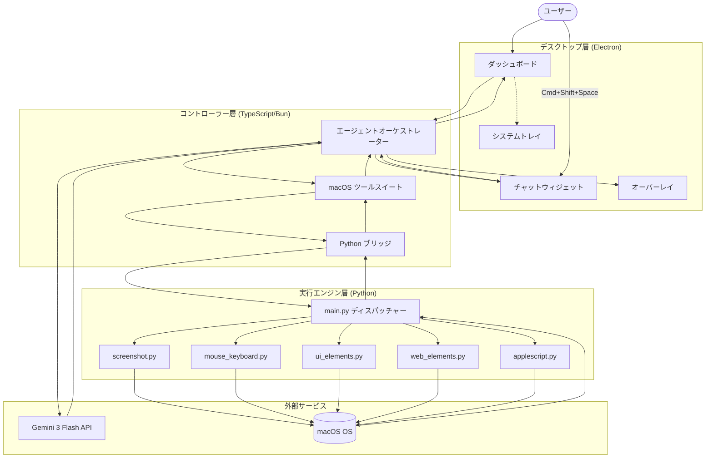
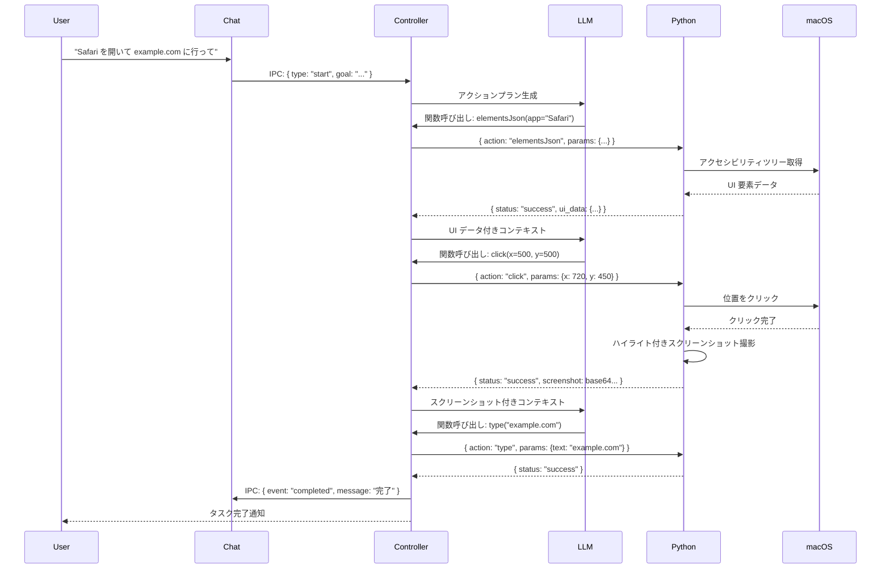
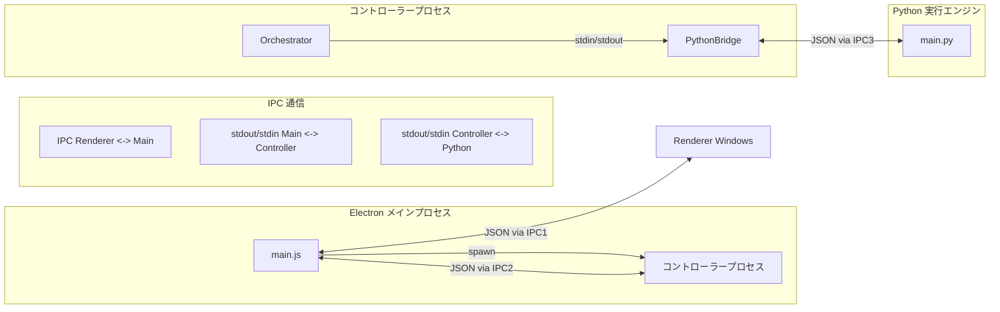
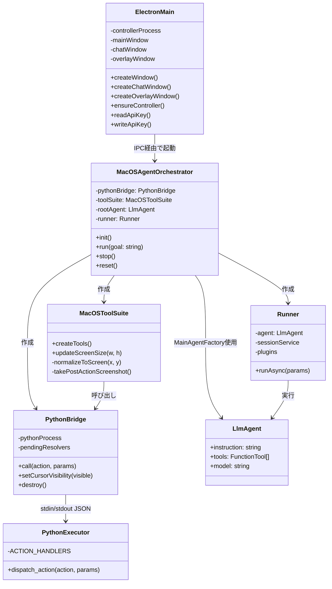

# Miki AI Agent アーキテクチャ解説

日本語 | [English](./ARCHITECTURE.md)

このプロジェクトは、**「思考（LLM）」**と**「実行（OS操作）」**を分離した、ハイブリッドなエージェントアーキテクチャを採用しています。他の言語や環境で同様のシステムを実装する際の参考にしてください。

---

## 目次

1. [全体構造](#1-全体構造)
2. [システムアーキテクチャ図](#2-システムアーキテクチャ図)
3. [主要コンポーネントの役割](#3-主要コンポーネントの役割)
4. [実装の核心的な仕組み](#4-実装の核心的な仕組み)
5. [セキュリティ機能](#5-セキュリティ機能)
6. [パフォーマンス設定](#6-パフォーマンス設定)
7. [アクション・スキーマ詳細](#7-アクション・スキーマ詳細)
8. [他の言語で実装する場合のヒント](#8-他の言語で実装する場合のヒント)

---

## 1. 全体構造

Miki Desktop は **Electron デスクトップ**、**TypeScript コントローラー**、**Python 実行エンジン** の3層アーキテクチャで構成されています。



---

## 2. システムアーキテクチャ図

### 2.1 データフロー: ユーザーリクエストの実行



### 2.2 プロセス間通信アーキテクチャ



### 2.3 コンポーネント関係図



---

## 3. 主要コンポーネントの役割

### A. Electron メインプロセス (`desktop/main.js`)

**役割**: デスクトップアプリケーションフレームワーク、ウィンドウ管理、プロセス起動

**主な機能**:
- マルチウィンドウ管理（ダッシュボード、チャットウィジェット、オーバーレイ）
- システムトレイ統合とコンテキストメニュー
- グローバルショートカット登録 (`Cmd+Shift+Space`)
- Electron の `safeStorage` を使用した API キーの暗号化
- パーミッション確認（アクセシビリティ、画面録画）
- 動的ノンス生成によるコンテンツセキュリティポリシー（CSP）
- コントローラープロセスの起動と IPC 通信

**なぜ Electron か？**
- クロスプラットフォームデスクトップアプリフレームワーク
- ネイティブ macOS 統合（トレイ、ショートカット、パーミッション）
- 安全なキー保存機能
- React による Web ベース UI 開発

### B. コントローラー層 (TypeScript/Bun)

#### B.1 エージェントオーケストレーター (`src/adk/orchestrator.ts`)

**役割**: LLM エージェント実行の中央コーディネーター

**責務**:
- 画面サイズでのツールスイート初期化
- Gemini 3 Flash での LLM エージェント作成・設定
- セッション状態とユーザーコンテキストの管理
- UI 更新用イベント発行（ログ、ステータス、アクション、完了）
- 停止・リセット要求の処理
- ログ記録プラグインによるデバッグモード対応

**主要メソッド**:
- `init()`: 画面サイズ、ブラウザ検出、ツールスイート、エージェントの初期化
- `run(goal)`: イベントストリーミングによるタスク実行
- `stop()`: 正常停止要求
- `reset()`: エージェント状態リセット

#### B.2 Python ブリッジ (`src/core/python-bridge.ts`)

**役割**: TypeScript と Python 間の通信層

**責務**:
- stdin/stdout 経由の Python プロセス起動
- JSON ベースのコマンド・レスポンスプロトコル
- 自動クラッシュリカバリーと再起動
- タイムアウトとリトライロジック（デフォルト30秒、最大3回リトライ）
- キューベースのリクエスト処理

**なぜ TypeScript か？**
- LLM SDK (Google Generative AI) の型安全な利用
- Python と LLM との効率的な連携（Promise/Async-Await）
- Zod による厳密な JSON スキーマ検証
- Bun によるモダンな JavaScript ランタイム

#### B.3 macOS ツールスイート (`src/adk/tools/macos-tool-suite.ts`)

**役割**: macOS 自動化のための LLM 呼び出し可能ツールの提供

**利用可能なツール**:
| ツール | 説明 | パラメータ |
|--------|------|------------|
| `click` | 正規化座標をクリック | x, y (0-1000) |
| `move` | マウスカーソル移動 | x, y (0-1000) |
| `drag` | ドラッグ＆ドロップ | from_x, from_y, to_x, to_y |
| `scroll` | 垂直スクロール | amount（正=下方向） |
| `type` | テキスト入力 | text |
| `press` | 単一キー押下 | key |
| `hotkey` | キーコンビネーション押下 | keys[] |
| `elementsJson` | アクセシビリティツリー取得 | app_name |
| `focusElement` | UI 要素フォーカス | element_id |
| `webElements` | ブラウザ DOM 要素取得 | app_name |
| `osa` | AppleScript 実行 | script |
| `wait` | 指定秒数待機 | seconds |
| `think` | 思考プロセス記録 | thought, phase |
| `done` | タスク完了報告 | message |

### C. 実行エンジン層 (Python)

#### C.1 メインディスパッチャー (`src/executor/main.py`)

**役割**: OS 操作用コマンドディスパッチャー

**責務**:
- stdin からの JSON コマンド読み取り
- アクションハンドラーへのディスパッチ（15アクション）
- JSON 形式での結果返却
- 実行時間の計測

**アクションハンドラー**（合計929行）:
- `screenshot.py` - ハイライト付き画面キャプチャ
- `mouse_keyboard.py` - クリック、入力、キー押下、ホットキー、移動、スクロール、ドラッグ
- `applescript.py` - AppleScript 実行
- `ui_elements.py` - アクセシビリティ API 経由の UI 要素取得/フォーカス
- `web_elements.py` - ブラウザ DOM 要素取得

**なぜ Python か？**
- `pyautogui` によるクロスプラットフォーム GUI 操作
- `Pillow (PIL)` による画像処理
- `PyObjC` 経由の容易な macOS API アクセス
- 自動化向けの成熟したエコシステム

---

## 4. 実装の核心的な仕組み

### 4.1 プロセス間通信 (IPC)

**3層 IPC アーキテクチャ**:

1. **Renderer <-> Main (Electron IPC)**
   - `contextBridge` と `preload.js` 経由の安全な通信
   - メッセージ: `miki:start`, `miki:stop`, `miki:getApiKey` など

2. **Main <-> Controller (stdout/stdin)**
   - `readline` インターフェース経由の JSON プロトコル
   - コントローラーは別プロセスの Node.js として起動

3. **Controller <-> Python (stdout/stdin)**
   - `PythonBridge` 経由の JSON コマンド・レスポンス
   - リクエスト形式: `{"action": "click", "params": {"x": 720, "y": 450}}`
   - レスポンス形式: `{"status": "success", "execution_time_ms": 120, "data": "..."}`

### 4.2 座標系の正規化

**論理座標（0-1000 スケール）**

LLM は解像度に依存しない座標で思考します:

```typescript
// 正規化 (0-1000) -> 物理ピクセル
private normalizeToScreen(x: number, y: number): { x: number; y: number } {
  return {
    x: Math.round((x / 1000) * this.screenSize.width),
    y: Math.round((y / 1000) * this.screenSize.height),
  };
}
```

**メリット**:
- 異なるディスプレイ解像度で同じプロンプトを使用可能
- LLM の画面位置に関する推論が単純化
- Retina ディスプレイへの対応が容易

**フローの例**:
1. LLM 出力: `click(x=500, y=500)` (画面中央)
2. コントローラー変換: `{x: 720, y: 450}` (1440x900 ディスプレイの場合)
3. 実行エンジンが物理座標でクリック

### 4.3 スクリーンショットによる視覚的フィードバック

**ハイライト機能**:

各アクション実行後、実行エンジンは操作位置を赤い点でハイライトしたスクリーンショットをキャプチャします:

```python
# Python: screenshot.py
def screenshot(highlight_pos=None, quality=85):
    img = pyautogui.screenshot()
    if highlight_pos:
        draw = ImageDraw.Draw(img)
        draw.ellipse([...], fill="red")
    # base64 JPEG に変換
```

**メリット**:
- LLM が操作の成功を視覚的に確認可能
- エラーの蓄積を抑制
- ユーザーへの透明性向上

### 4.4 ネイティブ UI 検査

**AppleScript 経由のアクセシビリティツリー**:

視覚のみの制限を補うため、ネイティブ UI 要素を取得します:

```applescript
tell application "System Events"
    tell process "Safari"
        set elements to entire contents of front window
    end tell
end tell
```

**データ構造**:
```json
{
  "role": "AXButton",
  "title": "Go",
  "position": {"x": 720, "y": 450},
  "size": {"width": 50, "height": 30},
  "children": [...]
}
```

### 4.5 ブラウザ自動化

**DOM 要素検出**:

Web 自動化のため、AppleScript 経由で DOM 要素を抽出します:

```applescript
tell application "Safari"
    do JavaScript "document.querySelectorAll('*').length" in front document
end tell
```

**対応ブラウザ**:
- Safari（デフォルト）
- Google Chrome
- Microsoft Edge
- Arc
- Brave
- Opera
- Vivaldi
- Chromium ベースのブラウザ全般

---

## 5. セキュリティ機能

### 5.1 API キーの暗号化

**Electron `safeStorage` 統合**:

```javascript
// 暗号化
const encrypted = safeStorage.encryptString(apiKey);
fs.writeFileSync(securePath, encrypted);

// 復号化
const encryptedData = fs.readFileSync(securePath);
const decrypted = safeStorage.decryptString(encryptedData);
```

**平文からの移行**:
- 古い `.env` ファイルは自動的に暗号化ストレージに移行
- 移行時の検証ステップでデータ損失を防止

### 5.2 コンテンツセキュリティポリシー (CSP)

**動的ノンス生成**:

```javascript
function generateNonce() {
  return crypto.randomBytes(16).toString("base64");
}

csp = `default-src 'self'; script-src 'self'; style-src 'self' 'nonce-${nonce}'`;
```

**ウィンドウごとのノンス**:
- 各ウィンドウが独自のノンスを持つ
- スタイルインジェクション攻撃を防止
- Emotion (CSS-in-JS) が安全に動作

### 5.3 コンテンツ保護

**画面キャプチャ防止**:

```javascript
win.setContentProtection(true);
```

**制限事項**:
- macOS 15+ の ScreenCaptureKit では完全に防げない場合がある
- 一部の画面録画ツールはキャプチャ可能
- 内部スクリーンリーダーは防止不可

### 5.4 コンテキスト分離

**Electron セキュリティベストプラクティス**:

```javascript
webPreferences: {
  preload: path.join(__dirname, "preload.js"),
  contextIsolation: true,
  nodeIntegration: false
}
```

**安全な IPC ブリッジ**:
```javascript
// preload.js
contextBridge.exposeInMainWorld('miki', {
  start: (goal) => ipcRenderer.invoke('miki:start', goal),
  getApiKey: () => ipcRenderer.invoke('miki:getApiKey'),
});
```

### 5.5 アクションホワイトリスト

**制限されたアクションセット**:

15個の定義済みアクションのみ許可:
- 任意のコード実行なし
- ファイルシステム書き込みなし（safeStorage を除く）
- ネットワークリクエストなし（LLM API を除く）
- Zod スキーマによる入力 sanitization

### 5.6 フェイルセーフ機構

**PyAutoGUI 緊急停止**:

```python
pyautogui.FAILSAFE = True
```

マウスを隅 (0, 0) に移動させると、すべての操作が緊急停止します。

---

## 6. パフォーマンス設定

`src/core/constants.ts` に定義:

```typescript
export const PERFORMANCE_CONFIG = {
  // 最大エージェント実行ステップ数
  MAX_STEPS: 30,

  // ステップ間の遅延（ミリ秒）
  STEP_DELAY_MS: 500,

  // バッチアクション間の遅延
  BATCH_ACTION_DELAY_MS: 200,

  // スクリーンショットの JPEG 品質 (1-100)
  SCREENSHOT_QUALITY: 85,
};
```

**チューニングガイドライン**:
| 設定 | 増やすと... | 減らすと... |
|------|-------------|-------------|
| MAX_STEPS | 複雑なマルチステージタスク | シンプルな高速タスク |
| STEP_DELAY_MS | 低速システム/視覚的明確さ | 高速実行 |
| SCREENSHOT_QUALITY | 認識精度向上 | 帯域幅削減 |

**履歴サイズ制御**:

```typescript
export const HISTORY_CONFIG = {
  MAX_MESSAGES: 24,
  MAX_TEXT_CHARS: 1000,
  MAX_DATA_CHARS: 2000,
  MAX_UI_NODES: 200,
  MAX_WEB_ELEMENTS: 200,
  MAX_ACTIONS: 8,
};
```

コンテキストの蓄積によるトークン爆発を防止します。

---

## 7. アクション・スキーマ詳細

### 7.1 マウスアクション

#### クリック
```json
{
  "action": "click",
  "params": {
    "x": 500,
    "y": 500
  }
}
```

#### 移動
```json
{
  "action": "move",
  "params": {
    "x": 500,
    "y": 500
  }
}
```

#### ドラッグ
```json
{
  "action": "drag",
  "params": {
    "from_x": 300,
    "from_y": 300,
    "to_x": 700,
    "to_y": 700
  }
}
```

### 7.2 キーボードアクション

#### 入力
```json
{
  "action": "type",
  "params": {
    "text": "example.com"
  }
}
```

#### キー押下
```json
{
  "action": "press",
  "params": {
    "key": "enter"
  }
}
```

#### ホットキー
```json
{
  "action": "hotkey",
  "params": {
    "keys": ["cmd", "space"]
  }
}
```

### 7.3 UI アクション

#### UI 要素取得
```json
{
  "action": "elementsJson",
  "params": {
    "app_name": "Safari"
  }
}
```

#### 要素フォーカス
```json
{
  "action": "focusElement",
  "params": {
    "element_id": "AXElement-123"
  }
}
```

### 7.4 スクリーンショットアクション

```json
{
  "action": "screenshot",
  "params": {
    "highlight_pos": {
      "x": 720,
      "y": 450
    },
    "quality": 85
  }
}
```

---

## 8. 他の言語で実装する場合のヒント

### 8.1 言語選定のポイント

| レイヤー | 推奨言語 | 理由 |
|----------|----------|------|
| **コントローラー** | TypeScript, Python, Go, Rust | LLM API サポート、JSON 処理、非同期処理 |
| **実行エンジン** | Python, Swift, C#, JavaScript | OS 自動化ライブラリの充実 |

### 8.2 代替通信プロトコル

| プロトコル | メリット | デメリット |
|------------|----------|------------|
| **stdin/stdout** | シンプル、依存関係なし | 一方向通信のみ |
| **HTTP/gRPC** | 全二重、スケーラブル | セットアップが複雑 |
| **共有メモリ** | 大容量データの高速転送 | プラットフォーム依存 |
| **名前付きパイプ** | 双方向、シンプル | プラットフォーム依存 |

### 8.3 実装時の重要な考慮事項

1. **セキュリティ**: ホワイトリスト方式でアクションを制限、任意のコード実行を禁止
2. **フェイルセーフ**: 緊急停止機構は必須
3. **Retina ディスプレイ**: 座標変換時にスケールファクターを考慮
4. **エラーリカバリー**: クラッシュ時の自動プロセス再起動
5. **タイムアウト保護**: ハングアップ防止
6. **コンテキスト制限**: トークン使用量管理のための LLM 履歴サイズ制御

### 8.4 移植性チェックリスト

- [ ] 座標正規化システム
- [ ] プロセス間通信プロトコル
- [ ] スキーマ付きアクションホワイトリスト
- [ ] 視覚的フィードバック（ハイライト付きスクリーンショット）
- [ ] ネイティブ UI 検査機能
- [ ] エラーハンドリングとリトライロジック
- [ ] セキュリティ（暗号化ストレージ、CSP、入力検証）
- [ ] パフォーマンスチューニング定数

---

## ファイル参照

| コンポーネント | ファイルパス | 行数 |
|----------------|-------------|------|
| Electron メイン | `desktop/main.js` | 727 |
| オーケストレーター | `src/adk/orchestrator.ts` | 253 |
| Python ブリッジ | `src/core/python-bridge.ts` | 200 |
| ツールスイート | `src/adk/tools/macos-tool-suite.ts` | 250 |
| Python 実行エンジン | `src/executor/main.py` | 92 |
| アクションモジュール | `src/executor/actions/*.py` | 929 |

---

*最終更新: 2026-01-13*
